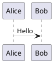
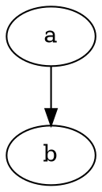

# Kroki Integration Design

## Problem

md2conf currently supports 3 diagram types (Draw.io, Mermaid, LaTeX), each requiring its own locally installed executable. Users must install `draw.io` CLI, `mmdc` (mermaid-cli), and/or `matplotlib` separately. Adding support for additional diagram-as-code formats (PlantUML, D2, GraphViz, etc.) would multiply this installation burden.

## Solution

Integrate [Kroki](https://kroki.io/) as a diagram rendering backend. Kroki is a Docker image (`yuzutech/kroki`) that bundles 25+ diagram-as-code tools behind a single HTTP API. md2conf will manage the Docker container lifecycle automatically, giving users a seamless experience — they just need Docker installed.

## Approach

**Phase 1 (this design):** Kroki as an additional rendering backend alongside existing renderers. Existing Mermaid/Draw.io/LaTeX support is unchanged.

**Future:** Optionally migrate all rendering to Kroki, eliminating the need for local tool installations.

## Architecture

### New Module: `md2conf/kroki.py`

#### `KrokiServer` Context Manager

Manages the Kroki Docker container lifecycle via subprocess calls to the `docker` CLI.

- **Lazy start:** Container only starts on the first `render()` call. No overhead if no Kroki diagrams are present.
- **Port selection:** Binds to an OS-assigned free port.
- **Health check:** Polls `/health` endpoint after `docker run` before returning.
- **Cleanup:** `docker stop` + `docker rm` in `__exit__()`.
- **Docker detection:** `shutil.which("docker")` — if missing, sets `available = False` and logs a warning.

```python
class KrokiServer:
    def __init__(self, port: int = 0, image: str = "yuzutech/kroki"): ...
    def __enter__(self) -> "KrokiServer": ...
    def __exit__(self, *exc): ...
    def _ensure_running(self) -> None: ...
    def render(self, diagram_type: str, source: str, output_format: str = "png") -> Optional[bytes]: ...
```

#### Format Registries

```python
KROKI_DIAGRAM_TYPES = {
    "plantuml": "plantuml",
    "d2": "d2",
    "graphviz": "graphviz",
    "dot": "graphviz",
    "ditaa": "ditaa",
    "erd": "erd",
    "nomnoml": "nomnoml",
    "svgbob": "svgbob",
    "wavedrom": "wavedrom",
    "vega": "vega",
    "vegalite": "vegalite",
    "structurizr": "structurizr",
    "blockdiag": "blockdiag",
    "seqdiag": "seqdiag",
    "actdiag": "actdiag",
    "nwdiag": "nwdiag",
    "packetdiag": "packetdiag",
    "rackdiag": "rackdiag",
    "c4plantuml": "c4plantuml",
    "bytefield": "bytefield",
    "pikchr": "pikchr",
    "umlet": "umlet",
    "wireviz": "wireviz",
    "symbolator": "symbolator",
}

KROKI_FILE_EXTENSIONS = {
    ".puml": "plantuml",
    ".plantuml": "plantuml",
    ".d2": "d2",
    ".dot": "graphviz",
    ".gv": "graphviz",
    ".ditaa": "ditaa",
    ".erd": "erd",
    ".nomnoml": "nomnoml",
    ".bob": "svgbob",
    # etc.
}
```

### Converter Integration

#### Fenced Code Blocks

In `_transform_code_block()`, after the existing Mermaid check:

```python
if language_id == "mermaid":
    return self._transform_fenced_mermaid(content)
elif language_name in KROKI_DIAGRAM_TYPES:
    return self._transform_fenced_kroki(language_name, content)
```

#### Image References

In `_transform_image()`, before the final `else`:

```python
elif absolute_path.suffix in KROKI_FILE_EXTENSIONS:
    return self._transform_kroki_file(absolute_path, attrs)
```

#### New Methods

- `_transform_fenced_kroki(diagram_type, content)` — renders via Kroki, stores in `embedded_files`, returns `_create_attached_image()`
- `_transform_kroki_file(absolute_path, attrs)` — reads file, renders via Kroki, same output pattern

### Pipeline Integration

`KrokiServer` lifecycle is owned at the processor level, wrapping the entire file processing run:

```
__main__.py (creates KrokiServer)
  -> Processor/Publisher (context manager)
    -> ConfluenceDocument.create() (passes instance)
      -> ConfluenceStorageFormatConverter (uses for rendering)
```

Same pattern for `local.py`.

### CLI Options

```
--render-kroki / --no-render-kroki    (default: True)
--kroki-image TEXT                     (default: "yuzutech/kroki")
```

### Domain Options

Added to `ConfluenceDocumentOptions`:

```python
render_kroki: bool = True
kroki_image: str = "yuzutech/kroki"
```

### Fallback Strategy

When `render_kroki=True` but Docker is unavailable or the container fails to start:

1. **Mermaid** fenced blocks: fall back to local `mmdc` if available, warn
2. **Draw.io** file references: fall back to local `draw.io` CLI if available, warn
3. **All other Kroki types** (PlantUML, D2, etc.): no local fallback exists — warn and emit as a plain code block
4. Warning is logged once per diagram type, not per diagram instance

### Markdown Syntax

Fenced code blocks (same convention as GitHub/GitLab/Obsidian):

````


```d2
x -> y: hello
```


````

Image references to standalone files:

```markdown


```

## Testing

### Unit Tests (`tests/test_kroki.py`)

- `KrokiServer` lifecycle with mocked subprocess/requests
- Lazy start verification
- Docker unavailable graceful degradation
- Container start failure handling
- `render()` HTTP API interaction
- Format registry consistency

### Converter Tests (additions to existing)

- Fenced code block dispatch for Kroki types
- Image reference dispatch for Kroki file extensions
- Fallback: Kroki unavailable + Mermaid -> local mmdc
- Fallback: Kroki unavailable + unknown type -> plain code block + warning

### Integration Tests

- Require Docker (skip if unavailable)
- Real KrokiServer rendering PlantUML, D2 diagrams
- Full pipeline with mixed diagram types

## Not In Scope

- Replacing existing Mermaid/Draw.io/LaTeX renderers with Kroki
- Companion containers (Mermaid via Kroki, BPMN, Excalidraw)
- Kroki diagram options/themes
- Confluence macro passthrough for Kroki types (no apps exist for most formats)

## No New Dependencies

- `requests` (already a dependency) for Kroki HTTP API
- `subprocess` (stdlib) for Docker CLI
- `shutil.which` (stdlib) for Docker detection
