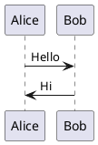
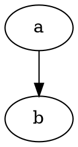

# Kroki Integration Implementation Plan

> **For Claude:** REQUIRED SUB-SKILL: Use superpowers:executing-plans to implement this plan task-by-task.

**Goal:** Add Kroki as a diagram rendering backend that auto-manages a Docker container, supporting 25+ diagram-as-code formats via fenced code blocks and file references.

**Architecture:** A new `kroki.py` module provides `KrokiServer` (context manager for Docker lifecycle) and format registries. The converter dispatches Kroki-supported languages/extensions to it. The server is lazy-started on first use and cleaned up after the run.

**Tech Stack:** Python stdlib (`subprocess`, `shutil`, `socket`), `requests` (existing dep), Docker CLI

---

### Task 1: Create `kroki.py` — Format Registries

**Files:**
- Create: `md2conf/kroki.py`
- Test: `tests/test_kroki.py`

**Step 1: Write the failing test**

Create `tests/test_kroki.py`:

```python
"""
Tests for Kroki diagram rendering integration.

Copyright 2022-2025, Levente Hunyadi

:see: https://github.com/hunyadi/md2conf
"""

import unittest

from md2conf.kroki import KROKI_DIAGRAM_TYPES, KROKI_FILE_EXTENSIONS


class TestKrokiRegistries(unittest.TestCase):
    def test_diagram_types_not_empty(self) -> None:
        self.assertGreater(len(KROKI_DIAGRAM_TYPES), 20)

    def test_file_extensions_not_empty(self) -> None:
        self.assertGreater(len(KROKI_FILE_EXTENSIONS), 5)

    def test_all_file_extension_types_in_diagram_types(self) -> None:
        """Every file extension must map to a known Kroki diagram type."""
        for ext, diagram_type in KROKI_FILE_EXTENSIONS.items():
            with self.subTest(ext=ext):
                self.assertIn(diagram_type, KROKI_DIAGRAM_TYPES.values())

    def test_file_extensions_start_with_dot(self) -> None:
        for ext in KROKI_FILE_EXTENSIONS:
            with self.subTest(ext=ext):
                self.assertTrue(ext.startswith("."), f"Extension {ext} must start with '.'")

    def test_known_types_present(self) -> None:
        """Verify key diagram types are registered."""
        for name in ["plantuml", "d2", "graphviz", "ditaa", "erd", "structurizr"]:
            with self.subTest(name=name):
                self.assertIn(name, KROKI_DIAGRAM_TYPES)

    def test_dot_is_alias_for_graphviz(self) -> None:
        self.assertEqual(KROKI_DIAGRAM_TYPES["dot"], "graphviz")


if __name__ == "__main__":
    unittest.main()
```

**Step 2: Run test to verify it fails**

Run: `python -m pytest tests/test_kroki.py -v`
Expected: FAIL with `ModuleNotFoundError: No module named 'md2conf.kroki'`

**Step 3: Write minimal implementation**

Create `md2conf/kroki.py` with the format registries:

```python
"""
Publish Markdown files to Confluence wiki.

Copyright 2022-2025, Levente Hunyadi

:see: https://github.com/hunyadi/md2conf
"""

import logging
from typing import Optional

LOGGER = logging.getLogger(__name__)

# Maps fenced code block language names to Kroki diagram type identifiers.
# These are the types supported by the core Kroki Docker image (no companion containers).
KROKI_DIAGRAM_TYPES: dict[str, str] = {
    "plantuml": "plantuml",
    "c4plantuml": "c4plantuml",
    "d2": "d2",
    "graphviz": "graphviz",
    "dot": "graphviz",
    "blockdiag": "blockdiag",
    "seqdiag": "seqdiag",
    "actdiag": "actdiag",
    "nwdiag": "nwdiag",
    "packetdiag": "packetdiag",
    "rackdiag": "rackdiag",
    "ditaa": "ditaa",
    "erd": "erd",
    "nomnoml": "nomnoml",
    "svgbob": "svgbob",
    "wavedrom": "wavedrom",
    "vega": "vega",
    "vegalite": "vegalite",
    "structurizr": "structurizr",
    "bytefield": "bytefield",
    "pikchr": "pikchr",
    "umlet": "umlet",
    "wireviz": "wireviz",
    "symbolator": "symbolator",
}

# Maps file extensions to Kroki diagram type identifiers.
KROKI_FILE_EXTENSIONS: dict[str, str] = {
    ".puml": "plantuml",
    ".plantuml": "plantuml",
    ".c4puml": "c4plantuml",
    ".d2": "d2",
    ".dot": "graphviz",
    ".gv": "graphviz",
    ".blockdiag": "blockdiag",
    ".seqdiag": "seqdiag",
    ".actdiag": "actdiag",
    ".nwdiag": "nwdiag",
    ".packetdiag": "packetdiag",
    ".rackdiag": "rackdiag",
    ".ditaa": "ditaa",
    ".erd": "erd",
    ".nomnoml": "nomnoml",
    ".bob": "svgbob",
    ".wavedrom": "wavedrom",
    ".vega": "vega",
    ".vegalite": "vegalite",
    ".structurizr": "structurizr",
    ".bytefield": "bytefield",
    ".pikchr": "pikchr",
    ".umlet": "umlet",
    ".wireviz": "wireviz",
    ".symbolator": "symbolator",
}
```

**Step 4: Run test to verify it passes**

Run: `python -m pytest tests/test_kroki.py -v`
Expected: All 6 tests PASS

**Step 5: Commit**

```bash
git add md2conf/kroki.py tests/test_kroki.py
git commit -m "feat(kroki): add format registries for diagram types and file extensions"
```

---

### Task 2: Create `KrokiServer` — Docker Lifecycle Management

**Files:**
- Modify: `md2conf/kroki.py`
- Test: `tests/test_kroki.py`

**Step 1: Write the failing tests**

Add to `tests/test_kroki.py`:

```python
import socket
from unittest.mock import MagicMock, patch

from md2conf.kroki import KrokiServer


class TestKrokiServerInit(unittest.TestCase):
    def test_default_values(self) -> None:
        server = KrokiServer()
        self.assertEqual(server.image, "yuzutech/kroki")
        self.assertFalse(server._started)
        self.assertTrue(server.available)

    def test_custom_image(self) -> None:
        server = KrokiServer(image="custom/kroki:latest")
        self.assertEqual(server.image, "custom/kroki:latest")


class TestKrokiServerDockerDetection(unittest.TestCase):
    @patch("shutil.which", return_value=None)
    def test_no_docker_sets_unavailable(self, mock_which: MagicMock) -> None:
        server = KrokiServer()
        server._ensure_running()
        self.assertFalse(server.available)

    @patch("shutil.which", return_value="/usr/bin/docker")
    @patch("subprocess.run")
    @patch("socket.socket")
    def test_docker_available_starts_container(
        self, mock_socket: MagicMock, mock_run: MagicMock, mock_which: MagicMock
    ) -> None:
        # Mock socket to return a free port
        mock_sock_instance = MagicMock()
        mock_sock_instance.getsockname.return_value = ("", 9999)
        mock_socket.return_value.__enter__ = MagicMock(return_value=mock_sock_instance)
        mock_socket.return_value.__exit__ = MagicMock(return_value=False)

        # Mock docker run succeeding
        mock_run.return_value = MagicMock(returncode=0, stdout="container_id_123\n")

        server = KrokiServer()
        # We patch _wait_for_health to avoid actual HTTP calls
        with patch.object(server, "_wait_for_health"):
            server._ensure_running()

        self.assertTrue(server._started)
        self.assertTrue(server.available)


class TestKrokiServerContextManager(unittest.TestCase):
    def test_context_manager_no_start(self) -> None:
        """Container should not start just from entering context."""
        with KrokiServer() as server:
            self.assertFalse(server._started)

    @patch("shutil.which", return_value=None)
    def test_context_manager_cleanup_when_not_started(self, mock_which: MagicMock) -> None:
        """Exit should not fail when container was never started."""
        with KrokiServer() as server:
            pass  # No render calls, so no container started


class TestKrokiServerLazyStart(unittest.TestCase):
    @patch("shutil.which", return_value=None)
    def test_render_triggers_ensure_running(self, mock_which: MagicMock) -> None:
        server = KrokiServer()
        result = server.render("plantuml", "@startuml\nA->B\n@enduml", "png")
        self.assertIsNone(result)  # Docker not available, returns None
```

**Step 2: Run tests to verify they fail**

Run: `python -m pytest tests/test_kroki.py::TestKrokiServerInit -v`
Expected: FAIL with `ImportError` (KrokiServer doesn't exist yet)

**Step 3: Write the implementation**

Add to `md2conf/kroki.py`:

```python
import shutil
import socket
import subprocess
import time
from typing import Literal

import requests


class KrokiServer:
    """
    Manages a Kroki Docker container lifecycle for rendering diagrams.

    Use as a context manager. The container is lazy-started on the first render() call
    and stopped/removed on exit.
    """

    image: str
    _started: bool
    _container_id: Optional[str]
    _port: Optional[int]
    _warned_types: set[str]
    available: bool

    def __init__(self, image: str = "yuzutech/kroki") -> None:
        self.image = image
        self._started = False
        self._container_id = None
        self._port = None
        self._warned_types = set()
        self.available = True

    def __enter__(self) -> "KrokiServer":
        return self

    def __exit__(self, *exc: object) -> None:
        self._stop()

    def _find_free_port(self) -> int:
        """Find a free port by binding to port 0."""
        with socket.socket(socket.AF_INET, socket.SOCK_STREAM) as s:
            s.bind(("", 0))
            return s.getsockname()[1]

    def _ensure_running(self) -> None:
        """Start the Kroki container if not already running."""
        if self._started:
            return

        if shutil.which("docker") is None:
            LOGGER.warning("Docker is not available; Kroki diagrams will not be rendered")
            self.available = False
            return

        port = self._find_free_port()
        cmd = [
            "docker", "run", "-d",
            "--rm",
            "-p", f"{port}:8000",
            "--name", f"md2conf-kroki-{port}",
            self.image,
        ]
        LOGGER.debug("Starting Kroki container: %s", " ".join(cmd))

        try:
            result = subprocess.run(cmd, capture_output=True, text=True, timeout=60)
            if result.returncode != 0:
                LOGGER.warning("Failed to start Kroki container: %s", result.stderr.strip())
                self.available = False
                return
            self._container_id = result.stdout.strip()
            self._port = port
            self._started = True
            self._wait_for_health()
            LOGGER.info("Kroki container started on port %d (container: %s)", port, self._container_id[:12])
        except (subprocess.TimeoutExpired, OSError) as e:
            LOGGER.warning("Failed to start Kroki container: %s", e)
            self.available = False

    def _wait_for_health(self, timeout: float = 30.0, interval: float = 0.5) -> None:
        """Poll the Kroki health endpoint until it responds or timeout."""
        url = f"http://localhost:{self._port}/health"
        deadline = time.monotonic() + timeout
        while time.monotonic() < deadline:
            try:
                resp = requests.get(url, timeout=2)
                if resp.status_code == 200:
                    return
            except requests.ConnectionError:
                pass
            time.sleep(interval)
        LOGGER.warning("Kroki container health check timed out after %.0fs", timeout)
        self._stop()
        self.available = False

    def _stop(self) -> None:
        """Stop and remove the Kroki container."""
        if self._container_id is not None:
            LOGGER.debug("Stopping Kroki container: %s", self._container_id[:12])
            try:
                subprocess.run(
                    ["docker", "stop", self._container_id],
                    capture_output=True, text=True, timeout=30,
                )
            except (subprocess.TimeoutExpired, OSError) as e:
                LOGGER.warning("Failed to stop Kroki container: %s", e)
            self._container_id = None
            self._started = False

    def render(self, diagram_type: str, source: str, output_format: Literal["png", "svg"] = "png") -> Optional[bytes]:
        """
        Render a diagram using the Kroki server.

        :param diagram_type: Kroki diagram type (e.g. "plantuml", "d2", "graphviz").
        :param source: Diagram source text.
        :param output_format: Output format ("png" or "svg").
        :returns: Rendered image bytes, or None if Kroki is unavailable.
        """
        self._ensure_running()
        if not self.available:
            if diagram_type not in self._warned_types:
                LOGGER.warning("Kroki unavailable; cannot render %s diagram", diagram_type)
                self._warned_types.add(diagram_type)
            return None

        url = f"http://localhost:{self._port}/{diagram_type}/{output_format}"
        try:
            resp = requests.post(url, data=source.encode("utf-8"), headers={"Content-Type": "text/plain"}, timeout=30)
            if resp.status_code != 200:
                LOGGER.error("Kroki render failed for %s: HTTP %d — %s", diagram_type, resp.status_code, resp.text[:200])
                return None
            return resp.content
        except requests.RequestException as e:
            LOGGER.error("Kroki render failed for %s: %s", diagram_type, e)
            return None
```

**Step 4: Run tests to verify they pass**

Run: `python -m pytest tests/test_kroki.py -v`
Expected: All tests PASS

**Step 5: Commit**

```bash
git add md2conf/kroki.py tests/test_kroki.py
git commit -m "feat(kroki): add KrokiServer context manager with Docker lifecycle management"
```

---

### Task 3: Add `render_kroki` and `kroki_image` to Domain Options and CLI

**Files:**
- Modify: `md2conf/domain.py:19-53` (add fields to `ConfluenceDocumentOptions`)
- Modify: `md2conf/__main__.py:28-53` (add to `Arguments` namespace)
- Modify: `md2conf/__main__.py:97-282` (add CLI flags to parser)
- Modify: `md2conf/__main__.py:316-329` (pass new options to `ConfluenceDocumentOptions`)

**Step 1: Write the failing test**

Add to `tests/test_kroki.py`:

```python
from md2conf.domain import ConfluenceDocumentOptions


class TestKrokiDomainOptions(unittest.TestCase):
    def test_default_render_kroki_true(self) -> None:
        opts = ConfluenceDocumentOptions()
        self.assertTrue(opts.render_kroki)

    def test_default_kroki_image(self) -> None:
        opts = ConfluenceDocumentOptions()
        self.assertEqual(opts.kroki_image, "yuzutech/kroki")

    def test_custom_kroki_image(self) -> None:
        opts = ConfluenceDocumentOptions(kroki_image="custom/kroki:v1")
        self.assertEqual(opts.kroki_image, "custom/kroki:v1")

    def test_render_kroki_false(self) -> None:
        opts = ConfluenceDocumentOptions(render_kroki=False)
        self.assertFalse(opts.render_kroki)
```

**Step 2: Run test to verify it fails**

Run: `python -m pytest tests/test_kroki.py::TestKrokiDomainOptions -v`
Expected: FAIL with `TypeError: ConfluenceDocumentOptions.__init__() got an unexpected keyword argument 'render_kroki'`

**Step 3: Write the implementation**

In `md2conf/domain.py`, add two fields to `ConfluenceDocumentOptions` (after `use_panel` at line 52):

```python
    render_kroki: bool = True
    kroki_image: str = "yuzutech/kroki"
```

Update the docstring to include:
```python
    :param render_kroki: Whether to render Kroki-supported diagrams using a Docker-managed Kroki server.
    :param kroki_image: Docker image to use for the Kroki server.
```

In `md2conf/__main__.py`, add to the `Arguments` class (after `use_panel: bool` at line 53):

```python
    render_kroki: bool
    kroki_image: str
```

In `get_parser()`, add after the `--use-panel` argument (after line 281):

```python
    parser.add_argument(
        "--render-kroki",
        dest="render_kroki",
        action="store_true",
        default=True,
        help="Render Kroki-supported diagrams using a Docker-managed Kroki server (default: enabled).",
    )
    parser.add_argument(
        "--no-render-kroki",
        dest="render_kroki",
        action="store_false",
        help="Disable Kroki diagram rendering; unsupported diagram types will be emitted as code blocks.",
    )
    parser.add_argument(
        "--kroki-image",
        dest="kroki_image",
        default="yuzutech/kroki",
        help="Docker image for the Kroki server (default: 'yuzutech/kroki').",
    )
```

In `main()`, add to the `ConfluenceDocumentOptions(...)` constructor call (after `use_panel=args.use_panel` at line 328):

```python
        render_kroki=args.render_kroki,
        kroki_image=args.kroki_image,
```

**Step 4: Run tests to verify they pass**

Run: `python -m pytest tests/test_kroki.py::TestKrokiDomainOptions -v`
Expected: All 4 tests PASS

Also run existing tests to ensure nothing broke:
Run: `python -m unittest discover -s tests`
Expected: All existing tests still pass

**Step 5: Commit**

```bash
git add md2conf/domain.py md2conf/__main__.py tests/test_kroki.py
git commit -m "feat(kroki): add render_kroki and kroki_image options to domain and CLI"
```

---

### Task 4: Wire `KrokiServer` into the Processing Pipeline

**Files:**
- Modify: `md2conf/converter.py:467-489` (`ConfluenceStorageFormatConverter.__init__`)
- Modify: `md2conf/converter.py:1787-1809` (`ConfluenceDocument.create`)
- Modify: `md2conf/converter.py:1811-1873` (`ConfluenceDocument.__init__`)
- Modify: `md2conf/processor.py:134-140` (`Processor._synchronize_page`)
- Modify: `md2conf/processor.py:261-291` (`Converter` class)
- Modify: `md2conf/publisher.py:228-248` (`SynchronizingProcessorFactory`, `Publisher`)
- Modify: `md2conf/local.py:91-119` (`LocalProcessorFactory`, `LocalConverter`)
- Modify: `md2conf/__main__.py:331-375` (`main()`)

This task threads the `KrokiServer` instance through the full pipeline. No rendering logic yet — just plumbing.

**Step 1: Write the failing test**

Add to `tests/test_kroki.py`:

```python
from pathlib import Path
from md2conf.kroki import KrokiServer


class TestKrokiPipelineWiring(unittest.TestCase):
    def test_kroki_server_accessible_from_converter(self) -> None:
        """Verify the converter constructor accepts a kroki_server parameter."""
        from md2conf.converter import ConfluenceStorageFormatConverter, ConfluenceConverterOptions
        from md2conf.collection import ConfluencePageCollection
        from md2conf.metadata import ConfluenceSiteMetadata

        # Create minimal test fixtures
        test_dir = Path(__file__).parent / "source"
        test_file = test_dir / "index.md"
        site = ConfluenceSiteMetadata(domain="test.atlassian.net", base_path="/wiki/", space_key="TEST")
        pages = ConfluencePageCollection()
        options = ConfluenceConverterOptions()
        server = KrokiServer()

        converter = ConfluenceStorageFormatConverter(options, test_file, test_dir, site, pages, kroki_server=server)
        self.assertIs(converter.kroki_server, server)

    def test_converter_works_without_kroki_server(self) -> None:
        """Verify the converter still works when kroki_server is None (backward compat)."""
        from md2conf.converter import ConfluenceStorageFormatConverter, ConfluenceConverterOptions
        from md2conf.collection import ConfluencePageCollection
        from md2conf.metadata import ConfluenceSiteMetadata

        test_dir = Path(__file__).parent / "source"
        test_file = test_dir / "index.md"
        site = ConfluenceSiteMetadata(domain="test.atlassian.net", base_path="/wiki/", space_key="TEST")
        pages = ConfluencePageCollection()
        options = ConfluenceConverterOptions()

        converter = ConfluenceStorageFormatConverter(options, test_file, test_dir, site, pages)
        self.assertIsNone(converter.kroki_server)
```

**Step 2: Run tests to verify they fail**

Run: `python -m pytest tests/test_kroki.py::TestKrokiPipelineWiring -v`
Expected: FAIL with `TypeError` (unexpected keyword argument `kroki_server`)

**Step 3: Write the implementation**

**`md2conf/converter.py`** — `ConfluenceStorageFormatConverter`:

At the top, add import (line 26 area):
```python
from .kroki import KrokiServer
```

Add to class attributes (after line 465 `page_metadata`):
```python
    kroki_server: Optional[KrokiServer]
```

Update `__init__` signature (line 467) to accept `kroki_server`:
```python
    def __init__(
        self,
        options: ConfluenceConverterOptions,
        path: Path,
        root_dir: Path,
        site_metadata: ConfluenceSiteMetadata,
        page_metadata: ConfluencePageCollection,
        kroki_server: Optional[KrokiServer] = None,
    ) -> None:
```

Add to `__init__` body (after `self.page_metadata = page_metadata` at line 489):
```python
        self.kroki_server = kroki_server
```

**`md2conf/converter.py`** — `ConfluenceDocument`:

Update `create` classmethod signature (line 1787) to accept `kroki_server`:
```python
    @classmethod
    def create(
        cls,
        path: Path,
        options: ConfluenceDocumentOptions,
        root_dir: Path,
        site_metadata: ConfluenceSiteMetadata,
        page_metadata: ConfluencePageCollection,
        kroki_server: Optional[KrokiServer] = None,
    ) -> tuple[ConfluencePageID, "ConfluenceDocument"]:
```

Update the return statement at line 1809:
```python
        return page_id, ConfluenceDocument(path, document, options, root_dir, site_metadata, page_metadata, kroki_server)
```

Update `__init__` signature (line 1811) to accept `kroki_server`:
```python
    def __init__(
        self,
        path: Path,
        document: ScannedDocument,
        options: ConfluenceDocumentOptions,
        root_dir: Path,
        site_metadata: ConfluenceSiteMetadata,
        page_metadata: ConfluencePageCollection,
        kroki_server: Optional[KrokiServer] = None,
    ) -> None:
```

Update the converter instantiation at line 1873:
```python
        converter = ConfluenceStorageFormatConverter(converter_options, path, root_dir, site_metadata, page_metadata, kroki_server=kroki_server)
```

**`md2conf/processor.py`**:

Add import:
```python
from .kroki import KrokiServer
```

Add `kroki_server` attribute to `Processor` (find `__init__`), add as optional parameter defaulting to `None`, store as `self.kroki_server`.

Update `_synchronize_page` (line 139) to pass it:
```python
        page_id, document = ConfluenceDocument.create(path, self.options, self.root_dir, self.site, self.page_metadata, kroki_server=self.kroki_server)
```

Add to `ProcessorFactory` and `Converter`:
- `ProcessorFactory` stores `kroki_server: Optional[KrokiServer]` and passes it to `create()`
- `Converter.process()` works unchanged — no lifecycle responsibility

**`md2conf/publisher.py`**:

Update `SynchronizingProcessor.__init__` to accept and store `kroki_server`.
Update `SynchronizingProcessorFactory` to accept, store, and pass `kroki_server`.
Update `Publisher.__init__` to accept and pass `kroki_server`.

**`md2conf/local.py`**:

Same pattern — `LocalProcessor`, `LocalProcessorFactory`, `LocalConverter` all accept and thread `kroki_server`.

**`md2conf/__main__.py`** — `main()`:

Wrap the processing in a `KrokiServer` context manager:

For the `local` branch (line 331-347):
```python
    if args.local:
        from .local import LocalConverter
        from .kroki import KrokiServer

        # ... site_properties / site_metadata setup unchanged ...

        kroki_server = KrokiServer(image=options.kroki_image) if options.render_kroki else None
        if kroki_server is not None:
            with kroki_server:
                LocalConverter(options, site_metadata, out_dir, kroki_server=kroki_server).process(mdpath)
        else:
            LocalConverter(options, site_metadata, out_dir).process(mdpath)
```

For the `else` (API) branch (line 348-375):
```python
        kroki_server = KrokiServer(image=options.kroki_image) if options.render_kroki else None
        if kroki_server is not None:
            with kroki_server:
                with ConfluenceAPI(properties) as api:
                    Publisher(api, options, kroki_server=kroki_server).process(mdpath)
        else:
            with ConfluenceAPI(properties) as api:
                Publisher(api, options).process(mdpath)
```

**Step 4: Run tests to verify they pass**

Run: `python -m pytest tests/test_kroki.py::TestKrokiPipelineWiring -v`
Expected: Both tests PASS

Run full test suite:
Run: `python -m unittest discover -s tests`
Expected: All existing tests still pass (kroki_server defaults to None everywhere)

**Step 5: Run static checks**

Run: `python -m mypy md2conf`
Expected: No type errors

**Step 6: Commit**

```bash
git add md2conf/converter.py md2conf/processor.py md2conf/publisher.py md2conf/local.py md2conf/__main__.py tests/test_kroki.py
git commit -m "feat(kroki): wire KrokiServer through processing pipeline"
```

---

### Task 5: Add Kroki Rendering for Fenced Code Blocks

**Files:**
- Modify: `md2conf/converter.py:901-936` (`_transform_code_block`)
- Modify: `md2conf/converter.py` (add `_transform_fenced_kroki` method after `_transform_fenced_mermaid`)

**Step 1: Write the failing test**

Create test source and target files:

Create `tests/source/kroki.md`:
````markdown
<!-- confluence-page-id: 0 -->

# Kroki Diagrams

## PlantUML



## D2

```d2
x -> y: hello
```

## GraphViz


````

Add to `tests/test_kroki.py`:

```python
from unittest.mock import patch, MagicMock


class TestKrokiFencedCodeBlocks(unittest.TestCase):
    def test_plantuml_fenced_block_dispatches_to_kroki(self) -> None:
        """A ```plantuml fenced block should render via Kroki when available."""
        from md2conf.converter import ConfluenceDocument
        from md2conf.collection import ConfluencePageCollection
        from md2conf.domain import ConfluenceDocumentOptions
        from md2conf.metadata import ConfluenceSiteMetadata

        test_dir = Path(__file__).parent / "source"
        test_file = test_dir / "kroki.md"
        site = ConfluenceSiteMetadata(domain="test.atlassian.net", base_path="/wiki/", space_key="TEST")
        pages = ConfluencePageCollection()
        options = ConfluenceDocumentOptions(render_kroki=True)

        # Mock a KrokiServer that returns fake PNG data
        mock_server = MagicMock(spec=KrokiServer)
        mock_server.render.return_value = b"\x89PNG fake image data"
        mock_server.available = True

        page_id, doc = ConfluenceDocument.create(test_file, options, test_dir, site, pages, kroki_server=mock_server)

        # Verify Kroki was called for each diagram type
        render_calls = mock_server.render.call_args_list
        diagram_types = [call.args[0] for call in render_calls]
        self.assertIn("plantuml", diagram_types)
        self.assertIn("d2", diagram_types)
        self.assertIn("graphviz", diagram_types)

        # Verify images were embedded
        self.assertGreater(len(doc.embedded_files), 0)

    def test_kroki_unavailable_falls_back_to_code_block(self) -> None:
        """When Kroki is unavailable, unsupported types should emit as code blocks."""
        from md2conf.converter import ConfluenceDocument
        from md2conf.collection import ConfluencePageCollection
        from md2conf.domain import ConfluenceDocumentOptions
        from md2conf.metadata import ConfluenceSiteMetadata

        test_dir = Path(__file__).parent / "source"
        test_file = test_dir / "kroki.md"
        site = ConfluenceSiteMetadata(domain="test.atlassian.net", base_path="/wiki/", space_key="TEST")
        pages = ConfluencePageCollection()
        options = ConfluenceDocumentOptions(render_kroki=True)

        # Mock a KrokiServer that is unavailable
        mock_server = MagicMock(spec=KrokiServer)
        mock_server.render.return_value = None
        mock_server.available = False

        page_id, doc = ConfluenceDocument.create(test_file, options, test_dir, site, pages, kroki_server=mock_server)

        # Should have no embedded files (fell back to code blocks)
        self.assertEqual(len(doc.embedded_files), 0)

    def test_render_kroki_false_emits_code_blocks(self) -> None:
        """When render_kroki is False, Kroki types should be plain code blocks."""
        from md2conf.converter import ConfluenceDocument
        from md2conf.collection import ConfluencePageCollection
        from md2conf.domain import ConfluenceDocumentOptions
        from md2conf.metadata import ConfluenceSiteMetadata

        test_dir = Path(__file__).parent / "source"
        test_file = test_dir / "kroki.md"
        site = ConfluenceSiteMetadata(domain="test.atlassian.net", base_path="/wiki/", space_key="TEST")
        pages = ConfluencePageCollection()
        options = ConfluenceDocumentOptions(render_kroki=False)

        page_id, doc = ConfluenceDocument.create(test_file, options, test_dir, site, pages, kroki_server=None)

        # No embedded files — all fell through to plain code blocks
        self.assertEqual(len(doc.embedded_files), 0)
```

**Step 2: Run tests to verify they fail**

Run: `python -m pytest tests/test_kroki.py::TestKrokiFencedCodeBlocks -v`
Expected: FAIL (Kroki language names not dispatched to any handler)

**Step 3: Write the implementation**

In `md2conf/converter.py`, update `_transform_code_block` (around line 921):

```python
        if language_id == "mermaid":
            return self._transform_fenced_mermaid(content)
        elif language_name is not None and language_name in KROKI_DIAGRAM_TYPES:
            return self._transform_fenced_kroki(language_name, content)
```

Add import at top of file:
```python
from .kroki import KROKI_DIAGRAM_TYPES, KrokiServer
```

Add the new method after `_transform_fenced_mermaid` (after line 982):

```python
    def _transform_fenced_kroki(self, diagram_type: str, content: str) -> ElementType:
        "Emits Confluence Storage Format XHTML for a diagram rendered via Kroki."

        kroki_type = KROKI_DIAGRAM_TYPES[diagram_type]

        if self.options.render_kroki and self.kroki_server is not None:
            image_data = self.kroki_server.render(kroki_type, content, self.options.diagram_output_format)
            if image_data is not None:
                image_hash = hashlib.md5(image_data).hexdigest()
                image_filename = attachment_name(f"embedded_{image_hash}.{self.options.diagram_output_format}")
                self.embedded_files[image_filename] = EmbeddedFileData(image_data)
                return self._create_attached_image(image_filename, ImageAttributes.EMPTY_BLOCK)

        # Fallback: emit as a plain code block
        return AC_ELEM(
            "structured-macro",
            {
                AC_ATTR("name"): "code",
                AC_ATTR("schema-version"): "1",
            },
            AC_ELEM(
                "parameter",
                {AC_ATTR("name"): "language"},
                diagram_type,
            ),
            AC_ELEM("plain-text-body", ET.CDATA(content)),
        )
```

Also need to add `render_kroki` to `ConfluenceConverterOptions` (around line 392-401):
```python
    render_kroki: bool = True
```

**Step 4: Run tests to verify they pass**

Run: `python -m pytest tests/test_kroki.py::TestKrokiFencedCodeBlocks -v`
Expected: All 3 tests PASS

**Step 5: Commit**

```bash
git add md2conf/converter.py tests/test_kroki.py tests/source/kroki.md
git commit -m "feat(kroki): render fenced code blocks via Kroki server"
```

---

### Task 6: Add Kroki Rendering for File References

**Files:**
- Modify: `md2conf/converter.py:713-720` (`_transform_image` dispatch)
- Modify: `md2conf/converter.py` (add `_transform_kroki_file` method)

**Step 1: Write the failing test**

Create a sample PlantUML file `tests/source/sample.puml`:
```
@startuml
Alice -> Bob: Hello
Bob -> Alice: Hi
@enduml
```

Create `tests/source/kroki-files.md`:
```markdown
<!-- confluence-page-id: 0 -->

# Kroki File References


```

Add to `tests/test_kroki.py`:

```python
class TestKrokiFileReferences(unittest.TestCase):
    def test_puml_file_dispatches_to_kroki(self) -> None:
        """A .puml image reference should render via Kroki."""
        from md2conf.converter import ConfluenceDocument
        from md2conf.collection import ConfluencePageCollection
        from md2conf.domain import ConfluenceDocumentOptions
        from md2conf.metadata import ConfluenceSiteMetadata

        test_dir = Path(__file__).parent / "source"
        test_file = test_dir / "kroki-files.md"
        site = ConfluenceSiteMetadata(domain="test.atlassian.net", base_path="/wiki/", space_key="TEST")
        pages = ConfluencePageCollection()
        options = ConfluenceDocumentOptions(render_kroki=True)

        mock_server = MagicMock(spec=KrokiServer)
        mock_server.render.return_value = b"\x89PNG fake image data"
        mock_server.available = True

        page_id, doc = ConfluenceDocument.create(test_file, options, test_dir, site, pages, kroki_server=mock_server)

        # Verify Kroki was called with plantuml type
        mock_server.render.assert_called_once()
        call_args = mock_server.render.call_args
        self.assertEqual(call_args.args[0], "plantuml")
        self.assertGreater(len(doc.embedded_files), 0)

    def test_puml_file_kroki_unavailable_warns(self) -> None:
        """A .puml file with no Kroki should produce a warning, not crash."""
        from md2conf.converter import ConfluenceDocument
        from md2conf.collection import ConfluencePageCollection
        from md2conf.domain import ConfluenceDocumentOptions
        from md2conf.metadata import ConfluenceSiteMetadata

        test_dir = Path(__file__).parent / "source"
        test_file = test_dir / "kroki-files.md"
        site = ConfluenceSiteMetadata(domain="test.atlassian.net", base_path="/wiki/", space_key="TEST")
        pages = ConfluencePageCollection()
        options = ConfluenceDocumentOptions(render_kroki=True)

        mock_server = MagicMock(spec=KrokiServer)
        mock_server.render.return_value = None
        mock_server.available = False

        # Should not raise — falls back gracefully
        with self.assertLogs(level="WARNING"):
            page_id, doc = ConfluenceDocument.create(test_file, options, test_dir, site, pages, kroki_server=mock_server)
```

**Step 2: Run tests to verify they fail**

Run: `python -m pytest tests/test_kroki.py::TestKrokiFileReferences -v`
Expected: FAIL (`.puml` files fall through to `_transform_attached_image`)

**Step 3: Write the implementation**

Add import at top of `converter.py` (if not already added):
```python
from .kroki import KROKI_FILE_EXTENSIONS
```

In `_transform_image` (lines 713-720), add before the final `else`:
```python
            elif absolute_path.suffix in KROKI_FILE_EXTENSIONS:
                return self._transform_kroki_file(absolute_path, attrs)
```

Add the new method after `_transform_fenced_kroki`:

```python
    def _transform_kroki_file(self, absolute_path: Path, attrs: ImageAttributes) -> ElementType:
        "Emits Confluence Storage Format XHTML for a diagram file rendered via Kroki."

        diagram_type = KROKI_FILE_EXTENSIONS[absolute_path.suffix]
        relative_path = path_relative_to(absolute_path, self.base_dir)

        if self.options.render_kroki and self.kroki_server is not None:
            with open(absolute_path, "r", encoding="utf-8") as f:
                content = f.read()
            image_data = self.kroki_server.render(diagram_type, content, self.options.diagram_output_format)
            if image_data is not None:
                image_filename = attachment_name(relative_path.with_suffix(f".{self.options.diagram_output_format}"))
                self.embedded_files[image_filename] = EmbeddedFileData(image_data, attrs.alt)
                return self._create_attached_image(image_filename, attrs)

        # Fallback: warn and emit a placeholder
        LOGGER.warning("Cannot render %s file %s: Kroki unavailable", diagram_type, absolute_path.name)
        return self._create_missing(Path(absolute_path.name), attrs)
```

**Step 4: Run tests to verify they pass**

Run: `python -m pytest tests/test_kroki.py::TestKrokiFileReferences -v`
Expected: Both tests PASS

**Step 5: Commit**

```bash
git add md2conf/converter.py tests/test_kroki.py tests/source/kroki-files.md tests/source/sample.puml
git commit -m "feat(kroki): render diagram file references via Kroki server"
```

---

### Task 7: Add Mermaid Fallback Logic

**Files:**
- Modify: `md2conf/converter.py` (`_transform_fenced_mermaid` and `_transform_external_mermaid`)

When Kroki is available, Mermaid could optionally go through it. But per the design, existing Mermaid support is unchanged. The fallback is the reverse: when a Mermaid fenced block encounters a Kroki-unavailable scenario but `mmdc` is installed locally, use `mmdc`.

This is already handled by the existing code path — `_transform_code_block` checks `language_id == "mermaid"` first, before the Kroki check. So Mermaid always goes through the existing handler. No code changes needed for this task.

**Step 1: Write the verification test**

Add to `tests/test_kroki.py`:

```python
class TestMermaidFallback(unittest.TestCase):
    def test_mermaid_not_dispatched_to_kroki(self) -> None:
        """Mermaid should use existing handler, not Kroki, even when Kroki is available."""
        from md2conf.converter import ConfluenceDocument
        from md2conf.collection import ConfluencePageCollection
        from md2conf.domain import ConfluenceDocumentOptions
        from md2conf.metadata import ConfluenceSiteMetadata

        test_dir = Path(__file__).parent / "source"

        # Create a minimal markdown file with only a mermaid block
        mermaid_md = test_dir / "kroki-mermaid-test.md"
        mermaid_md.write_text(
            '<!-- confluence-page-id: 0 -->\n\n```mermaid\ngraph TD\n  A-->B\n```\n',
            encoding="utf-8",
        )

        try:
            site = ConfluenceSiteMetadata(domain="test.atlassian.net", base_path="/wiki/", space_key="TEST")
            pages = ConfluencePageCollection()
            options = ConfluenceDocumentOptions(render_kroki=True, render_mermaid=False)

            mock_server = MagicMock(spec=KrokiServer)
            mock_server.available = True

            page_id, doc = ConfluenceDocument.create(test_file, options, test_dir, site, pages, kroki_server=mock_server)

            # Kroki render should NOT have been called for mermaid
            mock_server.render.assert_not_called()
        finally:
            mermaid_md.unlink(missing_ok=True)
```

**Step 2: Run the test**

Run: `python -m pytest tests/test_kroki.py::TestMermaidFallback -v`
Expected: PASS (mermaid dispatched to existing handler, not Kroki)

**Step 3: Commit**

```bash
git add tests/test_kroki.py
git commit -m "test(kroki): verify mermaid is not dispatched to Kroki"
```

---

### Task 8: Static Analysis and Full Test Suite

**Files:** None new — verification only

**Step 1: Run mypy**

Run: `python -m mypy md2conf`
Expected: No errors. Fix any type issues found (likely around `Optional[KrokiServer]` typing).

**Step 2: Run ruff**

Run: `python -m ruff check`
Run: `python -m ruff format --check`
Expected: No issues. Fix any found.

**Step 3: Run full test suite**

Run: `python -m unittest discover -s tests`
Expected: All tests pass (existing + new Kroki tests)

**Step 4: Run check.sh**

Run: `./check.sh`
Expected: All checks pass

**Step 5: Commit any fixes**

```bash
git add -u
git commit -m "fix: resolve static analysis issues for Kroki integration"
```

---

### Task 9: Integration Test with Real Docker

**Files:**
- Create: `integration_tests/test_kroki.py`

This test requires Docker to be running and will be skipped otherwise.

**Step 1: Write the integration test**

```python
"""
Integration tests for Kroki diagram rendering.

Requires Docker to be available and running.
"""

import shutil
import unittest

from md2conf.kroki import KrokiServer


@unittest.skipUnless(shutil.which("docker"), "Docker is not available")
class TestKrokiIntegration(unittest.TestCase):
    def test_render_plantuml_png(self) -> None:
        with KrokiServer() as server:
            result = server.render("plantuml", "@startuml\nAlice -> Bob: Hello\n@enduml", "png")
            self.assertIsNotNone(result)
            self.assertIn(b"PNG", result)

    def test_render_plantuml_svg(self) -> None:
        with KrokiServer() as server:
            result = server.render("plantuml", "@startuml\nAlice -> Bob: Hello\n@enduml", "svg")
            self.assertIsNotNone(result)
            self.assertIn(b"<svg", result)

    def test_render_d2(self) -> None:
        with KrokiServer() as server:
            result = server.render("d2", "x -> y: hello", "svg")
            self.assertIsNotNone(result)
            self.assertIn(b"<svg", result)

    def test_render_graphviz(self) -> None:
        with KrokiServer() as server:
            result = server.render("graphviz", "digraph { a -> b }", "svg")
            self.assertIsNotNone(result)
            self.assertIn(b"<svg", result)

    def test_render_ditaa(self) -> None:
        with KrokiServer() as server:
            result = server.render("ditaa", "+--------+\n| Hello  |\n+--------+", "svg")
            self.assertIsNotNone(result)

    def test_container_reused_across_renders(self) -> None:
        """Multiple renders should use the same container."""
        with KrokiServer() as server:
            server.render("plantuml", "@startuml\nA->B\n@enduml", "svg")
            container_id = server._container_id
            server.render("d2", "x -> y", "svg")
            self.assertEqual(server._container_id, container_id)

    def test_container_cleaned_up_on_exit(self) -> None:
        """Container should be stopped after context manager exits."""
        container_id = None
        with KrokiServer() as server:
            server.render("plantuml", "@startuml\nA->B\n@enduml", "svg")
            container_id = server._container_id
        self.assertIsNotNone(container_id)
        self.assertIsNone(server._container_id)


if __name__ == "__main__":
    unittest.main()
```

**Step 2: Run integration tests**

Run: `python -m unittest integration_tests.test_kroki -v`
Expected: All tests PASS (if Docker available) or SKIP (if not)

**Step 3: Commit**

```bash
git add integration_tests/test_kroki.py
git commit -m "test(kroki): add integration tests for real Docker rendering"
```
