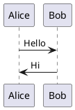
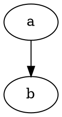

<!-- confluence-page-id: 0 -->

# Kroki Diagrams

## PlantUML


```plantuml
@startuml
Alice -> Bob: Hello
Bob -> Alice: Hi
@enduml
```

## D2

```d2
x -> y: hello
```

## GraphViz


```graphviz
digraph { a -> b }
```
